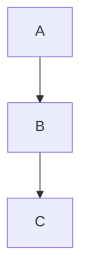

# Top-Tier Markdown Sample

A representative document exercising the full rendering surface for the
visual-golden gate.

## Headings, emphasis, links

This paragraph has **bold**, *italic*, ~~strikethrough~~, `inline code`, and a
[link](https://example.com).

### Lists and tasks

- plain bullet
- second bullet
  - nested bullet

1. first ordered
2. second ordered

- [x] done task
- [ ] open task

## Quote

> Design is not just what it looks like and feels like. Design is how it works.

## Code

```js
function greet(name) {
  return `Hello, ${name}!`;
}
```

## Table

| Feature | Light | Dark |
|---------|:-----:|:----:|
| Contrast | ok | ok |
| Density | comfy | comfy |

## Math

Inline: $E=mc^2$. Block:

$$
\int_0^\infty e^{-x^2}\,dx = \frac{\sqrt{\pi}}{2}
$$

## Diagram



## Footnote

The preview renders[^1] KaTeX server-side.

[^1]: Footnotes are supported via markdown-it-footnote.
